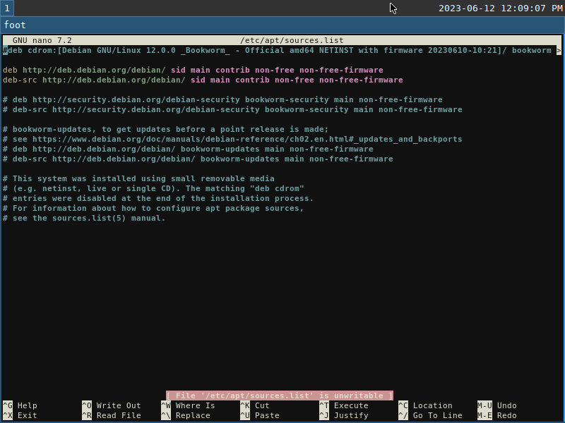

# debian-setting-shell
(if you want, make your disrtibution "sid")
## set sudo
```sh
su -
visudo
```

## sid
```sh
sudo nano /etc/apt/sources.list
```
3 つ目のフィールドをsidに
セキュリティ関連のものは削除する


```sh
sudo apt full-upgrade
```

## install git and clone
```sh
sudo apt update
sudo apt install git
cd ドキュメント
git clone 
```

## for gnome desktop

```sh
cd ./gdm
sh do1.sh
```

```sh
sh do2.sh
```

## for swaydm
- install debian with no desktop manager
  - but install 標準システムユーティリティ (standard system utilities)


